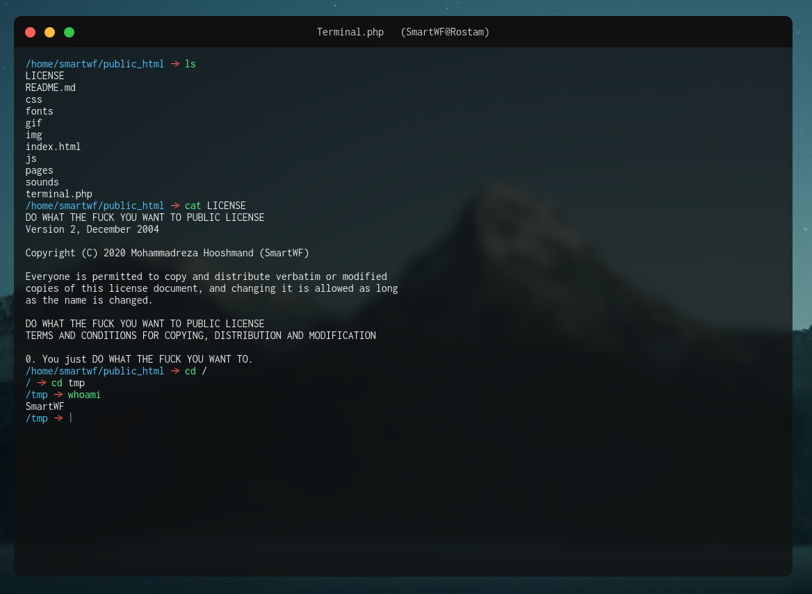

# Terminal.php - Web-based Terminal Emulator for PHP

A lightweight and customizable PHP-based terminal emulator that lets you run shell commands from your browser.  
🛠 Forked and extended from [SmartWF's terminal.php](https://github.com/smartwf/terminal.php) with improvements in customization and security.

---

## 📸 Screenshot



---

## 🚀 Features

- Execute server-side shell commands via web UI
- Define custom PHP-based commands
- Prevent execution of dangerous commands
- Ajax-based command execution for better UX
- Compatible with Laravel (CSRF/auth supported)
- Clean HTML output formatting
- Tools discovery & caching (with filtering/search)

---

## 🔐 Security Setup

To **prevent unauthorized access**, you **must set a secure `KEY`** inside `terminal.php`.  
The terminal will **not work with the default key**.

```php
const KEY = 'YourRandomSecureKey';
```

Access the terminal only via:

```
https://yourdomain.com/terminal.php?key=YourRandomSecureKey
# use in Laravel 
https://yourdomain.com/terminal?key=YourRandomSecureKey
```

> ⚠️ **Important:**  
> The terminal will be **disabled** if the default key is not changed.  
> Make sure to use a long, random, and secret key to prevent unauthorized access.

---

## ⚙️ Hosting Tips

If you encounter the error:

```
fatal: $HOME not set
```

Set the environment variables at the top of the script:

```php
putenv("HOME=/tmp");
putenv("COMPOSER_HOME=/home/yourDomainName");
```

Replace `/home/yourDomainName` with the correct home directory for your hosting environment.

---

## 🧩 Custom Commands

You can define your own PHP-based commands inside the `CustomCommands` class:

```php
public static function hi($args) {
    return 'Hi ' . implode(' ', $args);
}
```

To call: `hi Javad`

---

## 🚫 Block Dangerous Commands

You can block dangerous commands like `rm`, `wget`, or `mv` to protect your server:

```php
$config = [
    ...
    'blockedCommands' => ['rm', 'mv', 'chmod', 'wget', 'curl', 'cp'],
];
```

Blocked commands return a security message instead of being executed.

---

## 📂 File Structure

- `terminal.php` - Main entry file for terminal interface
- `CustomCommands` - Define additional PHP commands
- `TerminalPHP` - Shell command runner and local command processor

---

## ⚙️ Laravel Integration

Want to integrate the terminal into your Laravel app and keep it secure? Here’s how to do it the Laravel way:

### ✅ Recommended Setup (with CSRF + Auth Protection)

1. **Move terminal HTML content into a Blade file**

   Create a new Blade view at `resources/views/terminal.blade.php` and copy the HTML content from `terminal.php` into it.

2. **Enable Laravel mode in the config**

   Set the Laravel mode flag in the config section of `terminal.php`:
   
   ```php
   $config = [
       'laravelMode' => true,
       ...
   ];
   ```

3. **Define a protected Laravel route**

   Add this route to your `routes/web.php` to support both GET and POST requests:

   ```php
   use Illuminate\Support\Facades\Route;

   Route::match(['get', 'post'], '/terminal', function () {
       return view('terminal'); // or use a custom view path
   })->middleware('auth');
   ```

   💡 This setup ensures CSRF protection and restricts terminal access to authenticated users only.

---

## 👨‍💻 Author

Maintained and extended by **[Javad Fathi](https://github.com/javadamin1)**  
Originally by [SmartWF](https://github.com/smartwf)

---

## 📝 License

MIT License
